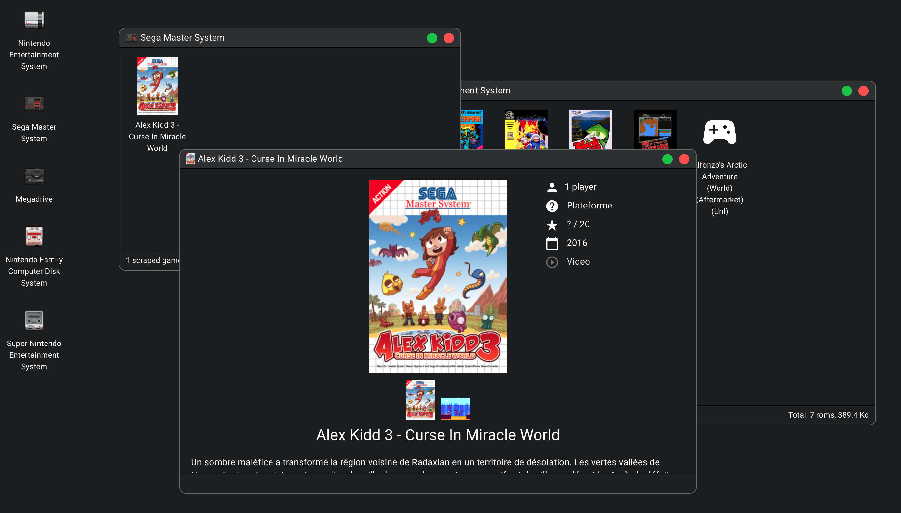

# Game Library (frontend)

This frontend is using [CRA](https://create-react-app.dev/), [React](https://reactjs.org/) and [MUI](https://mui.com/).

## Links

- [Backend](https://github.com/jbdemonte/game-library-backend)
- [Online demo](https://jb.demonte.fr/demos/game-library/)
- [dev.to article](https://dev.to/jbdemonte/create-a-window-manager-with-react-3mak)

## Screenshot



## Development

Copy `.env.example` to `.env` and modify it.

Install the dependencies using `yarn` (or `npm`):

```shell
yarn 
```

Start the development server:

```shell
yarn start
```

## Production

Build the project:

```shell
yarn build
```

It produces the `build` folder which contains the static files.

The [backend](https://github.com/jbdemonte/game-library-backend) provides a docker build which automatically includes this frontend.


## Credits

- Consoles Icons from [OpenEmu](https://openemu.org/).
- Medias from [Screenscraper](https://www.screenscraper.fr/).

## Licence

<p xmlns:cc="http://creativecommons.org/ns#" xmlns:dct="http://purl.org/dc/terms/">
    <a property="dct:title" rel="cc:attributionURL" href="https://github.com/jbdemonte/game-library-front">Game Library (frontend)</a> by <a rel="cc:attributionURL dct:creator" property="cc:attributionName" href="https//jb.demonte.fr">Jean-Baptiste Demonte</a> is licensed under <a href="http://creativecommons.org/licenses/by-nc-sa/4.0/?ref=chooser-v1" target="_blank" rel="license noopener noreferrer" style="display:inline-block;">CC BY-NC-SA 4.0
        
        
        
        
    </a>
</p>
